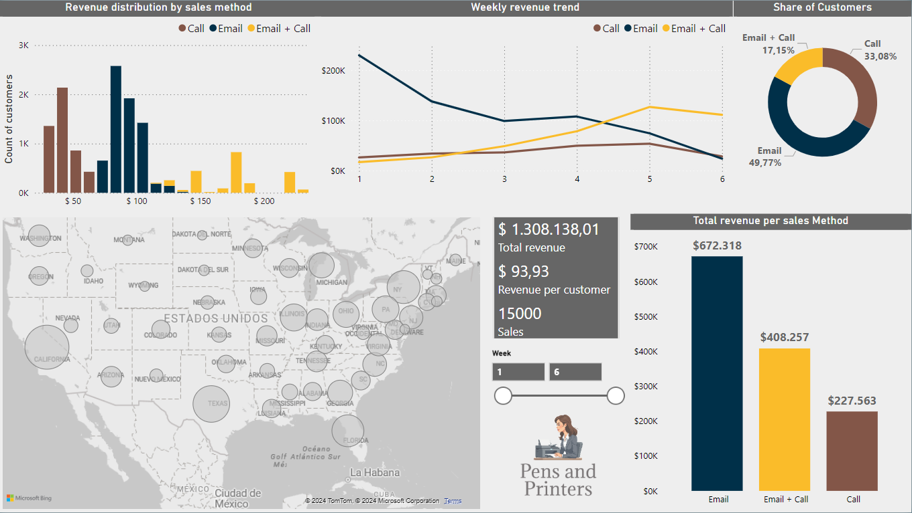

# Sales Data Analysis
## 📌 Project Overview  
This project was developed as part of the **Data Analyst Certification** on DataCamp. It involves **data cleaning, analysis, and visualization** using Python and Jupyter Notebook. Additionally, a **Power BI dashboard** was created to present key insights.  

The dataset used in this project is **fictional** and represents sales data from a company called **"Pens & Printers"**, which sells office supplies. The analysis focuses on **the performance of different sales methods** to identify trends and optimize sales strategies.

## 🗂 Project Structure  
- **Dataset:** [`sales_data.csv`](sales_data.csv)  
- **Jupyter Notebook:** [`sales_analysis.ipynb`](sales_analysis.ipynb)  
- **Power BI Dashboard:** [View Report](https://app.powerbi.com/view?r=eyJrIjoiMWI1NGE3OWYtNmQ3My00ZjQ5LTg4OWItZDVhZWNlODQ1Nzg4IiwidCI6ImNmNTFjNGM0LThkOTktNGYzYi1iZmE3LTQ3ZGEyOTk2YjIzZCIsImMiOjR9&pageName=21a9f4de9f9d8ac90456)
- **Written Report:** [`written_report.pdf`](written_report.pdf)

## 🔧 Tools & Technologies  
- **Python** (Pandas, Numpy, Matplotlib, Seaborn)  
- **Jupyter Notebook**  
- **Power BI**

## 📊 Key Insights  
- The **Email + Call** method outperforms all other methods by a significant margin, showing the highest overall revenue per customer.  
- On the other hand, the **Call** method demonstrates notably low revenue per customer, suggesting it is inefficient. Given that this method requires significantly more time investment, it is recommended to discontinue its use.  
- An increase in the number of **site visits** correlates with higher revenue across all sales methods, emphasizing the importance of driving more frequent visits to the site to boost overall revenue.

## 📊 Project Preview  
  
